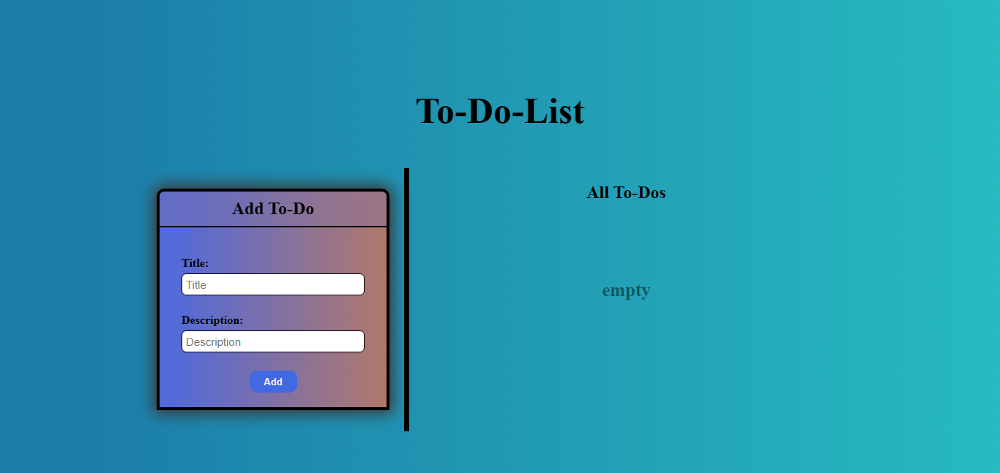
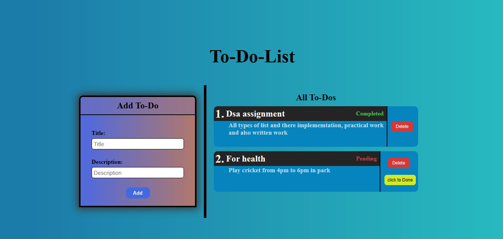
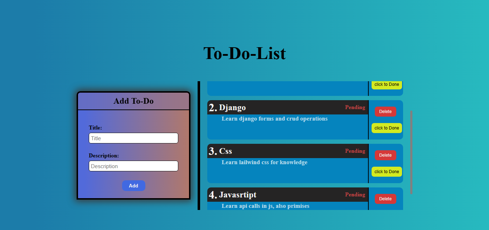

📝 To-Do List

A simple and beautiful To-Do List web application built with Django.
This project allows users to manage their daily tasks through a clean and simple web interface.

🚀 Features

- ➕ Add new tasks
- 🗑️ Delete tasks
- ✅ Mark tasks as completed
- 🎨 Clean and simple user interface
- 🌐 Django-powered web application

🛠️ Technologies Used

- Python
- Django
- HTML5
- CSS3
- SQLite
- Django Templates

📸 Screenshots

1st

2nd

3rd

📂 Project Structure

ToDo-List/
│
├── static/
│   └── stylesheets/
│
├── templates/
│
├── todoapp/
│   └── Application files
│
├── todolist/
│   └── Django project configuration
│
├── manage.py
├── .gitignore
└── README.md

⚙️ Installation

1. Clone the repository

git clone https://github.com/abdulrahman1919/ToDo-List.git

5. Install Django

pip install django

6. Apply migrations

python manage.py migrate

7. Run the development server

python manage.py runserver

Now open the application in your browser:

http://127.0.0.1:8000/

🎯 Project Purpose

The main purpose of this project is to build a practical web application using Django and understand the fundamentals of web development, including:

- Django project structure
- Django applications
- URL routing
- Views
- Templates
- Models
- Database operations
- CRUD operations
- Static files
- Django development workflow

🔄 CRUD Operations

The application demonstrates the basic CRUD workflow:

Operation| Description
Create| Add a new task
Read| View tasks
Delete| Remove a task

🤝 Contributing

Contributions, suggestions, and improvements are welcome.

1. Fork the repository
2. Create a new branch
3. Make your changes
4. Commit your changes
5. Push the branch
6. Open a Pull Request

📄 License

This project is available for educational and personal use.

👨‍💻 Author

Abdul Rahman Amin

GitHub:
https://github.com/abdulrahman1919

---

⭐ If you find this project useful, consider giving it a star.
